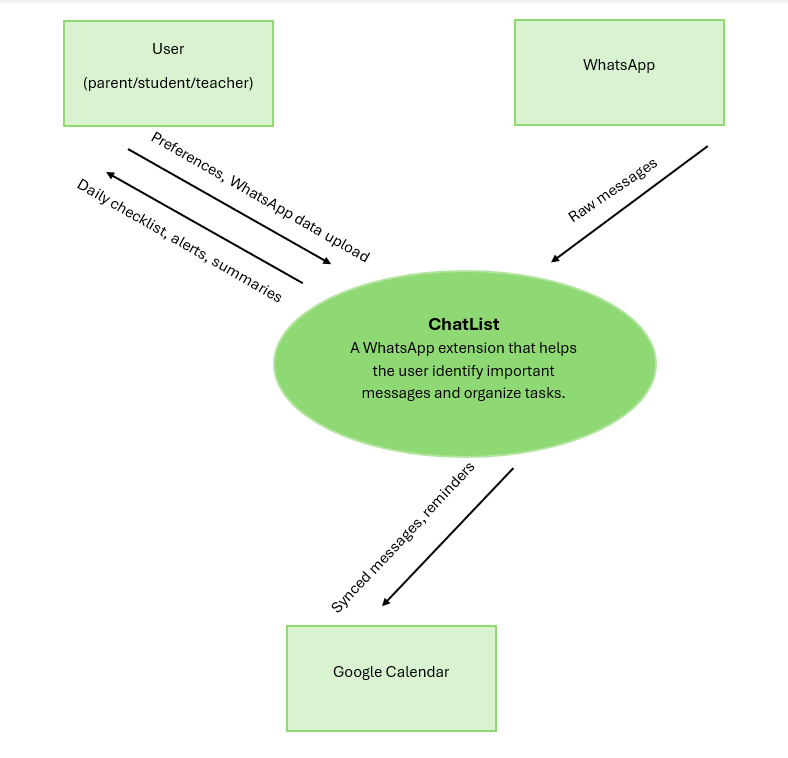

**Project name: ChatList**
**Date:** 20/10/2025
**Participants:** Talya Leizerovich, Tamar Klein, Chaya Azmon. 
                  

**Abstract:**
Every parent or student knows the chaos of school WhatsApp groups - endless chatter mixed with a few important messages you can’t afford to miss. ChatList is a smart AI-powered assistant designed to automatically filter, summarize, and extract action items from group messages.  
Using Natural Language Processing (NLP) and contextual understanding, ChatList identifies relevant information such as deadlines, items to bring, and upcoming events - and generates a personalized daily checklist for each user.  
Target audience: families, students, and anyone struggling to keep up with message overload.  
Goal: to bring clarity and focus back to communication and peace back to group chats.

**Background:**
WhatsApp has become the central communication tool for schools, classes, and community activities. Yet, the flood of messages often hides critical information like reminders, materials, and event details. Users waste time scrolling through irrelevant chatter, leading to confusion, missed deadlines, and frustration.
ChatList aims to solve this by applying AI and NLP to detect, extract, and organize relevant messages into clear, actionable summaries.  
By turning noisy conversations into a clean, daily to-do list, ChatList saves time, reduces stress, and enhances family organization.  
The system combines AI-based text classification, semantic filtering, and an intuitive interface - delivering both technological innovation and social impact.

**Definition of Goals and Objectives:**

**General Goal 1:**
[Develop an AI system that filters and summarizes WhatsApp group messages to highlight key action items.]  
SMART Objectives:
*   [Detect and classify relevant task-related messages using NLP models.](https://dev.azure.com/TalyaTamarChaya/ChatList/_workitems/edit/1/)
*   [Automatically generate a structured daily summary without user intervention.](https://dev.azure.com/TalyaTamarChaya/ChatList/_workitems/edit/11/)
    

**General Goal 2:**
[Build a user-friendly interface for personalized daily checklists.] 
SMART Objectives:
*   [Design an interactive UI that displays tasks and allows completion marking.](https://dev.azure.com/TalyaTamarChaya/ChatList/_workitems/edit/22/)
    
*   [Ensure smooth integration between the AI processing layer and the user interface for real-time data flow.](https://dev.azure.com/TalyaTamarChaya/ChatList/_workitems/edit/30/)

**Target Audience:**
*   **Parents and families** with children in schools or kindergartens.
    
*   **Students** managing multiple class or project group chats.
    
*   **Teachers and coordinators** who want to ensure their messages aren’t lost in the noise.
    
**Needs and Expectations:**
*   [Receive a concise summary instead of scrolling through hundreds of messages.](https://dev.azure.com/TalyaTamarChaya/ChatList/_workitems/edit/43/)
    
*   [Confidence that no important message or reminder will be missed.](https://dev.azure.com/TalyaTamarChaya/ChatList/_workitems/edit/64/)
    
*   [A clean, simple interface optimized for quick viewing and task tracking.](https://dev.azure.com/TalyaTamarChaya/ChatList/_workitems/edit/49/)

**Project Scope - Requirements:**

**Basic (Mandatory) Functionality:**
*   [Connection to WhatsApp group data (via API or exported messages).](https://dev.azure.com/TalyaTamarChaya/ChatList/_workitems/edit/32/)
    
*   [AI-based message classification (task, reminder, irrelevant).](https://dev.azure.com/TalyaTamarChaya/ChatList/_workitems/edit/2/)
    
*   [Generation of a daily checklist per user.](https://dev.azure.com/TalyaTamarChaya/ChatList/_workitems/edit/20/)
    

**Additional Functionality:**
*   [Multi-user support (separate lists for each family member).](https://dev.azure.com/TalyaTamarChaya/ChatList/_workitems/edit/68/)
    
*   [Integration with Google Calendar or system notifications.](https://dev.azure.com/TalyaTamarChaya/ChatList/_workitems/edit/62/)
    
*   [Smart prioritization by urgency and importance.](https://dev.azure.com/TalyaTamarChaya/ChatList/_workitems/edit/66/)
    
*   [Option to mark tasks as “completed.”](https://dev.azure.com/TalyaTamarChaya/ChatList/_workitems/edit/53/)
    
**Constraints:**

*   **Technical:** Limited access to WhatsApp APIs - may require workaround via message export or WhatsApp Business API.
    
*   **Time:** One-semester development window, focus on core MVP first.
    
*   **Budget:** Use only open-source NLP tools (HuggingFace, spaCy) and free-tier APIs.
    
*   **Human Resources:** Small team (3 members) responsible for NLP, backend, and UI.
    
*   **Ethical & Privacy:** Messages analyzed locally, no personal data stored beyond essential processing.

**Context Diagram:**

